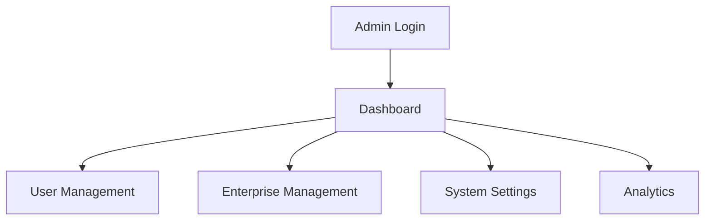
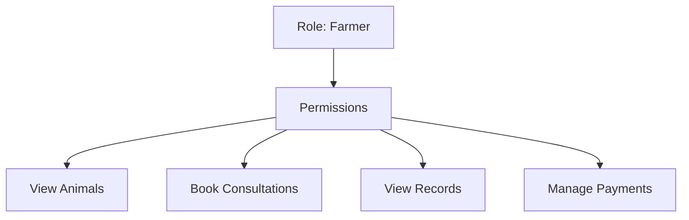

# Admin Guide - Online Veterinary Portal

## Overview
As an **Administrator**, you manage the entire system: users, enterprises, permissions, and global settings. You have full access to all features.

## Key Features
- 👥 User Management (create, edit, deactivate users)
- 🏢 Enterprise Management (approve, configure enterprises)
- ⚙️ System Settings (permissions, notifications, backups)
- 📊 System Analytics (usage stats, performance metrics)
- 🔒 Security (audit logs, access controls)

## Getting Started

### Login
```
Email: admin@vetcare.com
Password: Admin@123
```

### Dashboard Overview
Your dashboard shows:
- Total users, enterprises, and active consultations
- Recent system activities
- Pending approvals



## How to Use

### 1. Manage Users
**Purpose**: Create and manage all user accounts.

**Steps**:
1. Go to **Users** → **User Management**
2. Click **+ New User**
3. Fill: Name, Email, Role (Admin/Doctor/Farmer/Owner), Enterprise
4. Set password and permissions
5. Click **Create**

**Visual**: User list with roles and status badges.

### 2. Approve Enterprises
**Purpose**: Review and approve new enterprise registrations.

**Steps**:
1. Go to **Enterprises** → **Enterprise Management**
2. Find pending enterprises (status: "Pending")
3. Click **Review** → Check documents
4. Click **Approve** or **Reject**

**Visual**: Enterprise cards with approval status.

### 3. Configure Permissions
**Purpose**: Set what each role can access.

**Steps**:
1. Go to **Settings** → **Permissions**
2. Select role (e.g., Farmer)
3. Check/uncheck permissions (e.g., "Book Consultations")
4. Click **Save**

**Diagram**:


### 4. Monitor System Health
**Purpose**: Check system performance and usage.

**Steps**:
1. Go to **Analytics** → **System Health**
2. View charts: Active users, server load, error rates
3. Export reports if needed

**Visual**: Dashboard with graphs and metrics.

## Common Tasks

### Reset User Password
1. Find user in **User Management**
2. Click **Edit** → **Reset Password**
3. Enter new password → Save

### Deactivate Enterprise
1. Go to enterprise details
2. Click **Deactivate** → Confirm
3. Users lose access to that enterprise

### View Audit Logs
1. Go to **Security** → **Audit Logs**
2. Filter by date/user/action
3. Export for compliance

## Tips
- Always review enterprise documents before approval
- Use bulk actions for multiple user updates
- Monitor system alerts daily
- Backup data regularly via Settings

## Troubleshooting
- **Can't login?** Check email/password, contact IT
- **Permission denied?** Verify your admin role
- **System slow?** Check Analytics for load issues