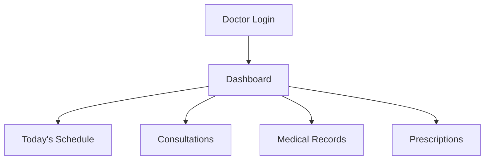
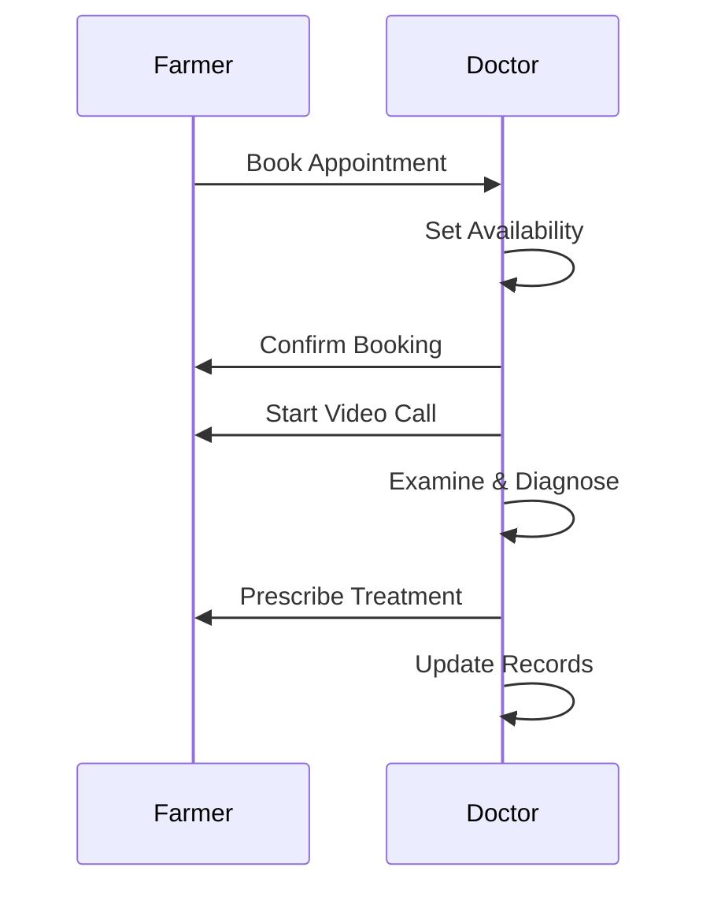

# Doctor Guide - Online Veterinary Portal

## Overview
As a **Doctor**, you provide veterinary consultations, manage patient records, and handle medical cases. Focus on animal health and client care.

## Key Features
- 🩺 Consultations (virtual appointments, diagnoses)
- 📋 Medical Records (history, treatments, prescriptions)
- 📅 Schedule Management (availability, appointments)
- 💊 Prescriptions (create, manage medications)
- 📊 Case Analytics (treatment success rates)

## Getting Started

### Login
```
Email: dr.james.carter@vetcare.com
Password: Doctor@123
```

### Dashboard Overview
Your dashboard shows:
- Today's appointments
- Pending consultations
- Recent patient cases
- Prescription alerts



## How to Use

### 1. Manage Schedule
**Purpose**: Set your availability for consultations.

**Steps**:
1. Go to **Schedule** → **My Availability**
2. Click **+ Add Slot**
3. Select date, time, duration (30/60 min)
4. Set recurring if needed
5. Click **Save**

**Visual**: Calendar view with booked/free slots.

### 2. Conduct Consultation
**Purpose**: Perform virtual appointments with farmers.

**Steps**:
1. Go to **Consultations** → **Today's Appointments**
2. Click **Start** on upcoming consultation
3. Video call opens automatically
4. Examine animal via camera/chat
5. Record diagnosis and treatment
6. End call → Generate prescription

**Diagram**:


### 3. Create Medical Record
**Purpose**: Document animal health history.

**Steps**:
1. Go to **Medical Records** → **+ New Record**
2. Select animal and farmer
3. Enter symptoms, diagnosis, treatment
4. Upload photos/X-rays if needed
5. Click **Save**

**Visual**: Form with sections for history, vitals, treatments.

### 4. Write Prescription
**Purpose**: Provide medication instructions.

**Steps**:
1. During/after consultation → **Create Prescription**
2. Select medications from database
3. Set dosage, frequency, duration
4. Add instructions (e.g., "Give with food")
5. Click **Send to Farmer**

**Visual**: Prescription template with drug list.

### 5. Review Analytics
**Purpose**: Track your performance and case outcomes.

**Steps**:
1. Go to **Analytics** → **My Cases**
2. View charts: Success rates, common diagnoses
3. Filter by date/animal type
4. Export reports

**Visual**: Dashboard with pie charts and trends.

## Common Tasks

### Emergency Consultation
1. Check **Urgent Cases** in dashboard
2. Click **Accept** to start immediately
3. Prioritize critical cases

### Update Patient History
1. Open existing record
2. Add new visit notes
3. Update treatment progress
4. Save changes

### Manage Prescriptions
1. Go to **Prescriptions** → **Active**
2. View farmer compliance
3. Send reminders if needed

## Tips
- Set regular office hours for routine cases
- Use templates for common diagnoses
- Upload clear photos during consultations
- Follow up on critical cases within 24 hours
- Keep detailed notes for legal/compliance

## Troubleshooting
- **Video not working?** Check internet, try refresh
- **Can't access records?** Verify enterprise permissions
- **Prescription errors?** Double-check dosages before sending