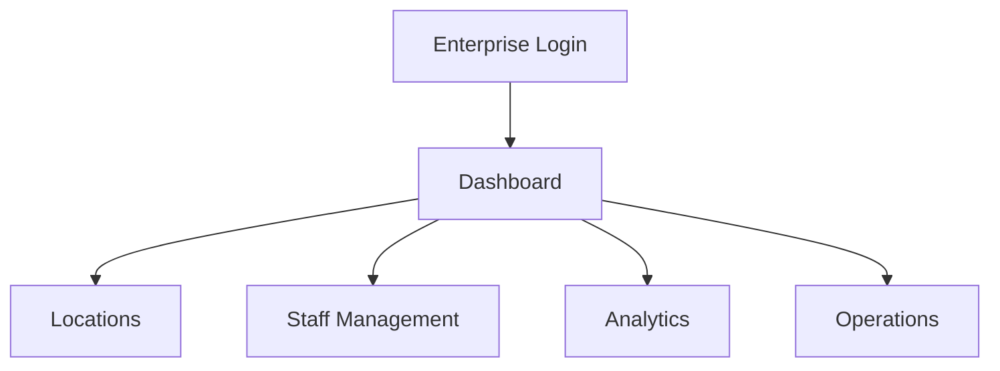
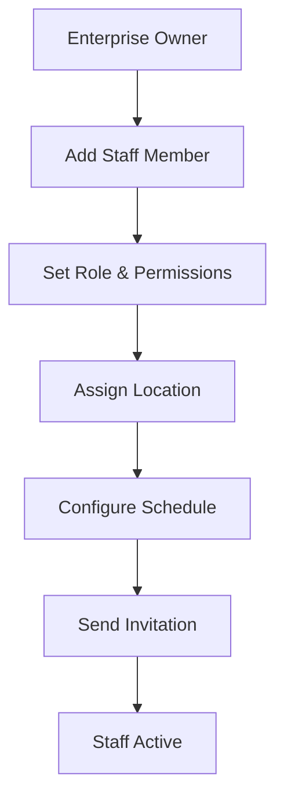

# Enterprise Owner Guide - Online Veterinary Portal

## Overview
As an **Enterprise Owner**, you manage multiple veterinary locations, staff, and operations. Oversee business performance and coordinate services.

## Key Features
- 🏢 Multi-Location Management (clinics, farms)
- 👥 Staff Administration (doctors, admins)
- 📈 Business Analytics (revenue, performance)
- 📋 Service Coordination (scheduling, resources)
- 💼 Enterprise Dashboard (overview, alerts)

## Getting Started

### Login
```
Email: sarah.johnson@vetcorp.com
Password: Enterprise@123
```

### Dashboard Overview
Your dashboard shows:
- All locations and their status
- Staff performance metrics
- Revenue and booking trends
- System alerts and notifications



## How to Use

### 1. Manage Locations
**Purpose**: Oversee multiple clinics and farms.

**Steps**:
1. Go to **Locations** → **My Facilities**
2. Click **+ Add Location**
3. Enter: Name, Address, Type (Clinic/Farm)
4. Assign local admin
5. Set operating hours
6. Click **Save**

**Visual**: Map view of all locations with status.

### 2. Staff Administration
**Purpose**: Hire and manage veterinary staff.

**Steps**:
1. Go to **Staff** → **Team Members**
2. Click **+ Add Staff**
3. Enter: Name, Role (Doctor/Admin), Location
4. Set permissions and schedule
5. Send invitation email
6. Monitor onboarding

**Diagram**:


### 3. Monitor Performance
**Purpose**: Track business metrics and KPIs.

**Steps**:
1. Go to **Analytics** → **Business Overview**
2. View revenue charts and trends
3. Check staff utilization rates
4. Review customer satisfaction scores
5. Export reports for stakeholders

**Visual**: Interactive dashboards with filters.

### 4. Coordinate Operations
**Purpose**: Manage daily operations across locations.

**Steps**:
1. Go to **Operations** → **Daily Schedule**
2. View all appointments across locations
3. Reassign bookings if needed
4. Monitor resource availability
5. Handle emergency situations

**Visual**: Calendar view with location filters.

### 5. Handle Approvals
**Purpose**: Review and approve enterprise requests.

**Steps**:
1. Go to **Approvals** → **Pending**
2. Review staff requests (time off, equipment)
3. Check location upgrade requests
4. Approve or deny with comments
5. Track approval history

**Visual**: Notification center with approval queue.

## Common Tasks

### Add New Location
1. Verify location requirements
2. Set up local infrastructure
3. Hire initial staff
4. Configure services offered
5. Launch location operations

### Staff Performance Review
1. Go to staff profile
2. View consultation metrics
3. Check customer feedback
4. Schedule performance discussion
5. Update compensation if needed

### Emergency Response
1. Receive alert notification
2. Assess situation severity
3. Contact on-duty staff
4. Coordinate resources if needed
5. Follow up on resolution

## Tips
- Set clear KPIs for each location
- Regular staff training sessions
- Monitor customer feedback closely
- Plan for seasonal demand spikes
- Maintain emergency response protocols

## Troubleshooting
- **Staff can't access system?** Check role permissions
- **Location data not updating?** Verify network connectivity
- **Reports not generating?** Check data sync status