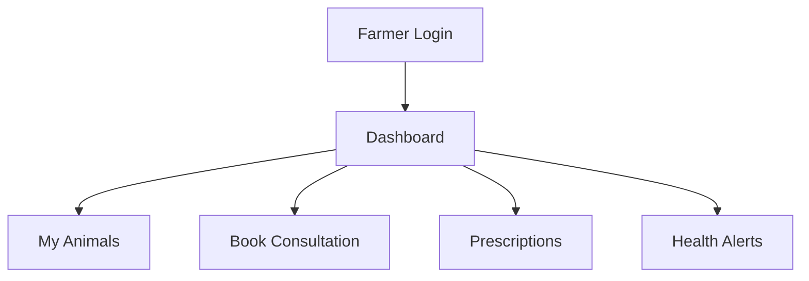
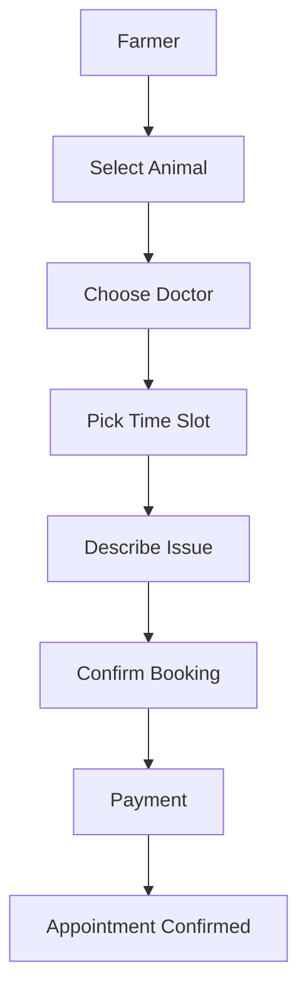

# Farmer Guide - Online Veterinary Portal

## Overview
As a **Farmer**, you manage your livestock, book veterinary consultations, and track animal health. Focus on your farm operations and animal welfare.

## Key Features
- 🐄 Animal Management (add, track, health records)
- 📅 Consultation Booking (schedule with doctors)
- 💊 Prescription Tracking (medications, reminders)
- 📊 Health Analytics (disease trends, breeding)
- 💰 Payment Management (bills, invoices)

## Getting Started

### Login
```
Email: john.miller@greenpastures.com
Password: Farmer@123
```

### Dashboard Overview
Your dashboard shows:
- Your animals and their health status
- Upcoming consultations
- Active prescriptions
- Farm alerts (sick animals, due vaccinations)



## How to Use

### 1. Add Animals
**Purpose**: Register your livestock for tracking.

**Steps**:
1. Go to **Animals** → **My Livestock**
2. Click **+ Add Animal**
3. Enter: Name, Species (Cow/Pig/Chicken), Breed, Age
4. Add photos and notes
5. Click **Save**

**Visual**: Animal cards with photos and status.

### 2. Book Consultation
**Purpose**: Schedule veterinary appointments.

**Steps**:
1. Go to **Consultations** → **Book Appointment**
2. Select animal and urgency level
3. Choose date/time from available slots
4. Describe symptoms/problem
5. Click **Book** → Pay if required

**Diagram**:


### 3. Track Prescriptions
**Purpose**: Follow medication schedules.

**Steps**:
1. Go to **Prescriptions** → **Active**
2. View medications for each animal
3. Mark doses as given
4. Set reminders for next dose
5. Contact doctor if issues

**Visual**: Timeline view of medication schedule.

### 4. Monitor Health
**Purpose**: Watch for disease patterns and alerts.

**Steps**:
1. Go to **Analytics** → **Farm Health**
2. View health trends and alerts
3. Check vaccination schedules
4. Review breeding recommendations

**Visual**: Dashboard with health status indicators.

### 5. Make Payments
**Purpose**: Pay for consultations and services.

**Steps**:
1. Go to **Payments** → **Outstanding Bills**
2. Select invoice → Choose payment method
3. Enter card details or use saved payment
4. Click **Pay Now**

**Visual**: Invoice list with payment status.

## Common Tasks

### Report Sick Animal
1. Go to animal's profile
2. Click **Report Issue**
3. Describe symptoms, upload photos
4. Request urgent consultation

### Update Animal Records
1. Open animal profile
2. Add weight, notes, or photos
3. Update health status
4. Save changes

### View Consultation History
1. Go to **Consultations** → **History**
2. Filter by animal or date
3. Review past diagnoses and treatments

## Tips
- Add all animals at setup for complete tracking
- Book routine check-ups quarterly
- Take clear photos of symptoms
- Keep medication logs accurate
- Respond quickly to health alerts

## Troubleshooting
- **Can't book appointment?** Check doctor availability
- **Payment failed?** Verify card details or contact support
- **Missed consultation?** Reschedule immediately, explain reason