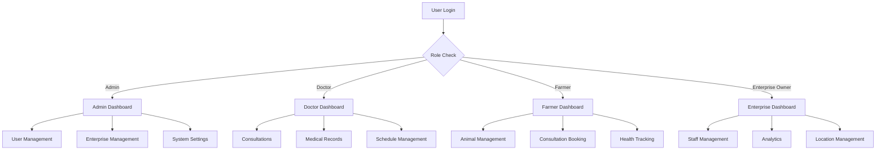

# Online Veterinary Doctor Consultation Portal - User Guides

Welcome to the functional documentation for the Online Veterinary Doctor Consultation Portal. This application helps manage veterinary services, animal health tracking, and enterprise operations.

## Available Roles & Guides

| Role | Description | Guide |
|------|-------------|-------|
| **Admin** | System administrator managing users, enterprises, and global settings | [Admin Guide](AdminGuide.md) |
| **Doctor** | Veterinary professional providing consultations and managing patient records | [Doctor Guide](DoctorGuide.md) |
| **Farmer** | Animal owner managing livestock, scheduling consultations, and tracking health | [Farmer Guide](FarmerGuide.md) |
| **Enterprise Owner** | Business owner overseeing multiple farms, managing staff, and enterprise analytics | [Enterprise Owner Guide](EnterpriseOwnerGuide.md) |

## Quick Start

1. **Login**: Use your role-specific credentials
2. **Dashboard**: Overview of your key metrics and recent activities
3. **Navigation**: Use the sidebar menu to access different modules
4. **Help**: Each page has tooltips and inline help

## System Overview

## Features by Module

- **Authentication**: Secure login with role-based access
- **Dashboard**: Personalized overview with key metrics
- **Animal Management**: Track livestock, health records, breeding
- **Consultation System**: Book, conduct, and manage virtual consultations
- **Medical Records**: Comprehensive health history and prescriptions
- **Enterprise Management**: Multi-farm operations and analytics
- **Geospatial Analytics**: Location tracking and zone management
- **Supply Chain**: Traceability from farm to consumer
- **Payment Integration**: Secure billing and invoicing

## Support

For technical issues, contact the system administrator. For feature requests, use the feedback form in your dashboard.