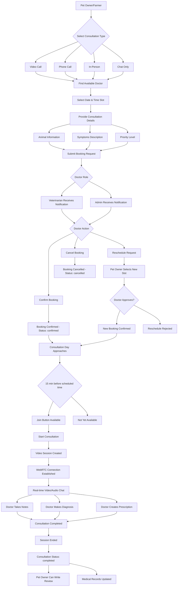
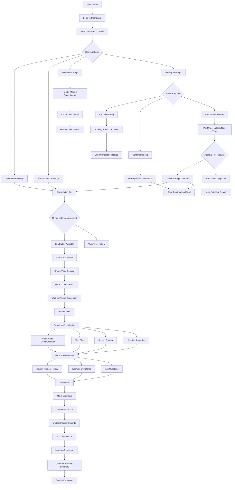
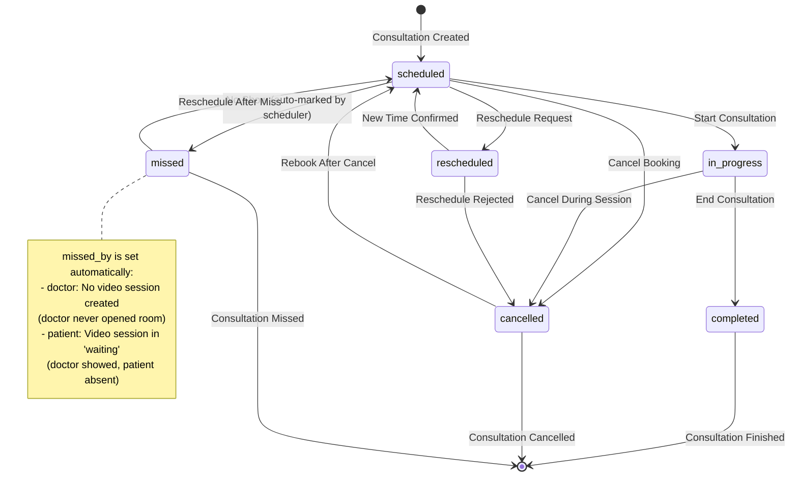
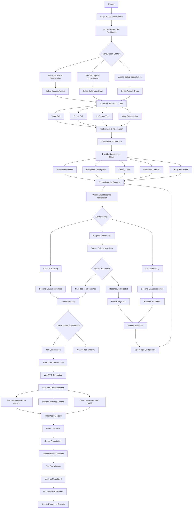
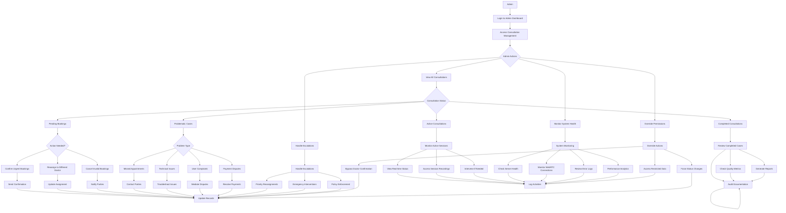
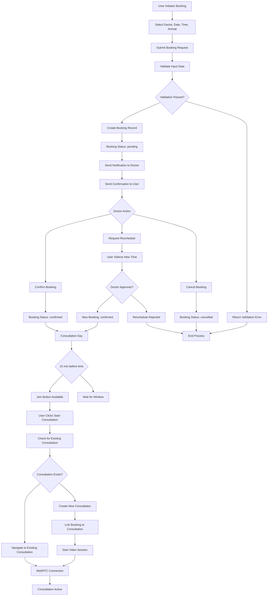
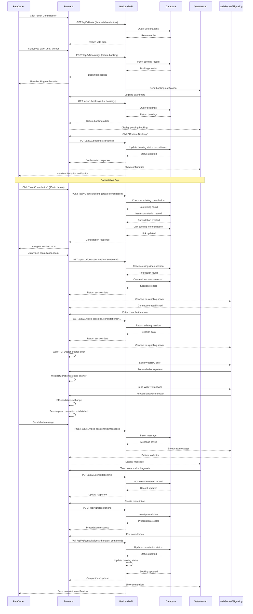
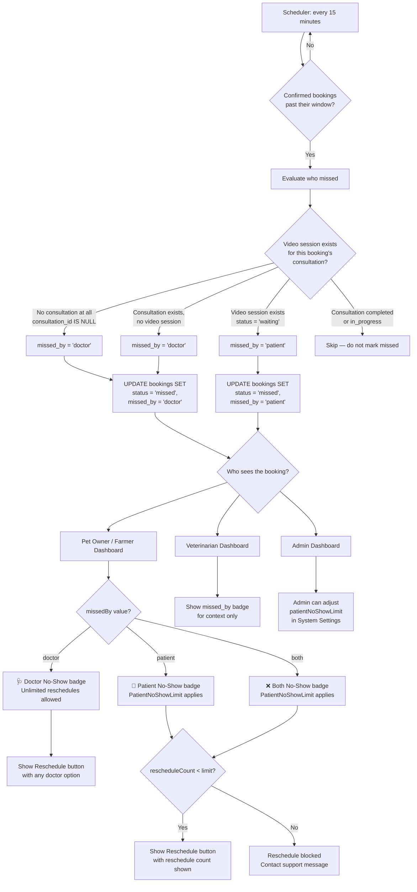

# VetCare Consultation Module Diagrams

This document contains all the functional workflow diagrams for the VetCare platform's consultation module.

## 1. Pet Owner Consultation Booking and Management Workflow



## 2. Veterinarian Consultation Management Workflow



## 3. Video Consultation Session Technical Flow

```mermaid
flowchart TD
    A[Consultation Started] --> B[Doctor Initiates Video Session]
    B --> C[Create Video Session Record in DB]
    C --> D[Doctor: WebRTC Host Mode]
    D --> E[Doctor: Request Camera/Microphone Access]

    E --> F{Device Access Granted?}
    F --> G[Video + Audio Stream]
    F --> H[Audio Only Stream]
    F --> I[No Media Stream]

    G --> J[Doctor: Create WebRTC Peer Connection]
    H --> J
    I --> J

    J --> K[Doctor: Create Offer (SDP)]
    K --> L[Send Offer to Signaling Server]
    L --> M[Patient Receives Notification]

    M --> N[Patient: Join Consultation Room]
    N --> O[Patient: WebRTC Guest Mode]
    O --> P[Patient: Request Camera/Microphone Access]

    P --> Q{Device Access Granted?}
    Q --> R[Video + Audio Stream]
    Q --> S[Audio Only Stream]
    Q --> T[No Media Stream]

    R --> U[Patient: Create WebRTC Peer Connection]
    S --> U
    T --> U

    U --> V[Patient: Send Answer to Signaling Server]
    V --> W[WebRTC Connection Established]

    W --> X[ICE Candidate Exchange]
    X --> Y[STUN/TURN Server Coordination]
    Y --> Z[Peer-to-Peer Connection]

    Z --> AA[Real-time Media Streaming]
    AA --> BB[Video Frames]
    AA --> CC[Audio Stream]
    AA --> DD[Data Channel for Chat]

    BB --> EE[Doctor Video Element]
    CC --> FF[Audio Playback]
    DD --> GG[Text Messages]

    EE --> HH[Consultation Active]
    FF --> HH
    GG --> HH

    HH --> II{Consultation Actions}
    II --> JJ[Doctor: Take Notes]
    II --> KK[Doctor: Make Diagnosis]
    II --> LL[Doctor: Create Prescription]
    II --> MM[Screen Sharing]
    II --> NN[Session Recording]
    II --> OO[End Consultation]

    JJ --> PP[Save to Consultation Record]
    KK --> PP
    LL --> PP
    MM --> QQ[Share Screen Stream]
    NN --> RR[Record Media Stream]

    OO --> SS[Close WebRTC Connection]
    SS --> TT[Update Session Status: ended]
    TT --> UU[Update Consultation Status: completed]
    UU --> VV[Generate Session Summary]
    VV --> WW[Send to Pet Owner]
```

## 4. Consultation Status State Transitions



## 5. Farmer Enterprise Consultation Workflow



## 6. Admin Consultation Oversight Workflow



## 7. Booking Creation and Deduplication Workflow



## 8. Consultation Module Architecture and Data Flow

```mermaid
flowchart TD
    A[Frontend Components] --> B[Consultations.tsx]
    A --> C[BookConsultation.tsx]
    A --> D[VideoConsultation.tsx]
    A --> E[doctor/ConsultationRoom.tsx]

    B --> F[API Service Calls]
    C --> F
    D --> F
    E --> F

    F --> G[Backend API Routes]
    G --> H[/api/v1/consultations]
    G --> I[/api/v1/bookings]
    G --> J[/api/v1/video-sessions]

    H --> K[ConsultationController]
    I --> L[BookingController]
    J --> M[VideoSessionController]

    K --> N[ConsultationService]
    L --> O[BookingService]
    M --> P[VideoSessionService]

    N --> Q[Database Layer]
    O --> Q
    P --> Q

    Q --> R[(PostgreSQL)]
    R --> S[consultations table]
    R --> T[bookings table]
    R --> U[video_sessions table]
    R --> V[users table]
    R --> W[animals table]

    N --> X[WebRTC Integration]
    P --> X

    X --> Y[Signaling Server]
    X --> Z[STUN/TURN Servers]

    E --> AA[useWebRTC Hook]
    D --> AA

    AA --> BB[Peer Connection]
    AA --> CC[Media Streams]
    AA --> DD[Data Channels]

    K --> EE[Notification System]
    L --> EE
    M --> EE

    EE --> FF[Email Service]
    EE --> GG[In-App Notifications]

    N --> HH[Medical Records Integration]
    HH --> II[PrescriptionService]
    HH --> JJ[MedicalRecordService]

    O --> KK[ScheduleService]
    KK --> LL[Vet Availability]
    KK --> MM[Time Slots]

    B --> NN[PermissionContext]
    C --> NN
    D --> NN
    E --> NN

    NN --> OO[Role-based Access]
    OO --> PP[pet_owner permissions]
    OO --> QQ[veterinarian permissions]
    OO --> RR[farmer permissions]
    OO --> SS[admin permissions]
```

## 9. Consultation Session Sequence Diagram



---

**Created:** March 10, 2026
**Updated:** May 2026 — Added missed_by tracking and no-show reschedule diagrams
**VetCare Platform Version:** v1.0
**Analysis:** Deep consultation module workflow analysis

## 10. No-Show Detection and Reschedule Rules Workflow

This diagram shows how the system detects WHO missed an appointment and applies the appropriate reschedule rules.



## 11. Admin No-Show Reschedule Limit Configuration

This diagram shows how admins configure the patient no-show reschedule policy.

```mermaid
flowchart TD
    A[Admin] --> B[System Settings Page]
    B --> C[Booking — No-Show Reschedule Rules]

    C --> D[Doctor No-Show Section]
    D --> E[Always Unlimited — fixed]
    E --> F[Patients get unlimited\nreschedule opportunities\nwhen doctor is at fault]

    C --> G[Patient No-Show Limit Section]
    G --> H{Select limit}
    H --> I[0 = Unlimited]
    H --> J[1 = Once only]
    H --> K[2 = Twice]
    H --> L[Custom number]

    I --> M[Save to system_settings:\nbooking.patientNoShowRescheduleLimit = 0]
    J --> N[Save to system_settings:\nbooking.patientNoShowRescheduleLimit = 1]
    K --> O[Save to system_settings:\nbooking.patientNoShowRescheduleLimit = 2]
    L --> P[Save custom value]

    M --> Q[SettingsContext reloads]
    N --> Q
    O --> Q
    P --> Q

    Q --> R[All frontend components\nget new limit in real-time]
    R --> S[Consultations.tsx:\ncanReschedule() uses new limit]
    R --> T[Reschedule modal:\nshows updated count info]
    R --> U[BookingService.ts:\nrescheduleBooking() enforces limit]
```